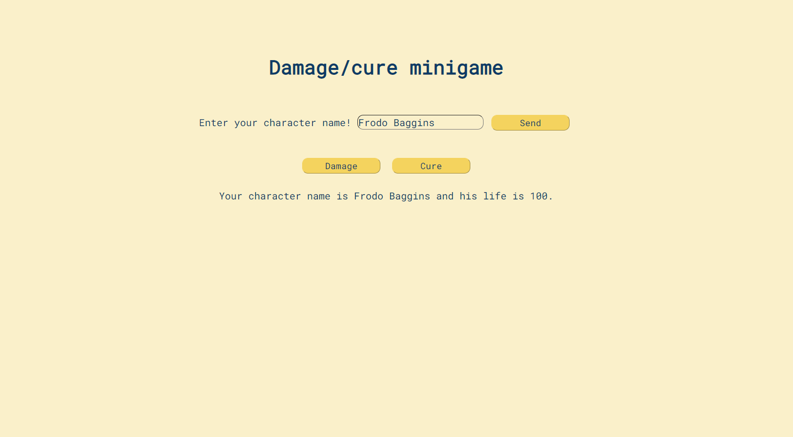

<h2>Damage/cure minigame exercise</h2>
 

 JS exercise developed during Senai's DEVinHouse course. You can choose a name for your character and than you can use the buttons to interact with your character's life. Making your character take damage or use the medkit.

 
<ul>
<li>HTML</li>
<li>CSS</li>
<li>JS</li>
</ul>
 
 

 